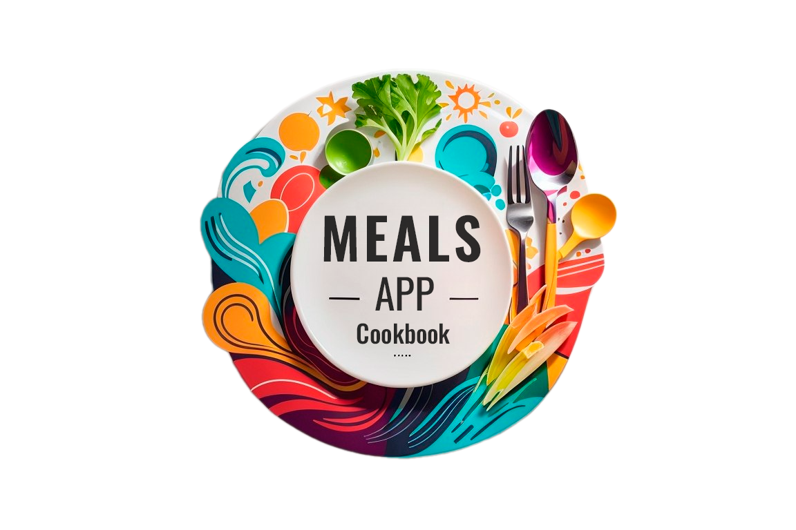

## About

Meals app (Cookbook) for Android. Meals app contains different categories of recipes, filters applied to recipes (e.g. gluten-free) and the ability to add your favorite recipe to your favorites!

## Documentation

**Features:**
- 10 Categories of Meals.
- Adding and removing a recipe from favorites.
- Filters to display certain recipes: Gluten-free, Lactose-free, Vegetarian, Vegan.
- Cute animations that complement the app.
- Application splash screen with logo.

**Stack:**
- Visual Studio Code, Flutter/Dart. 

**Packages:** 
- google_fonts, transparent_image, flutter_native_splash, flutter_riverpod.

## Application show:

- Application Splash Screen:

- Showing Recipes:

- Recipe Favorites:

- Recipe Filters:
